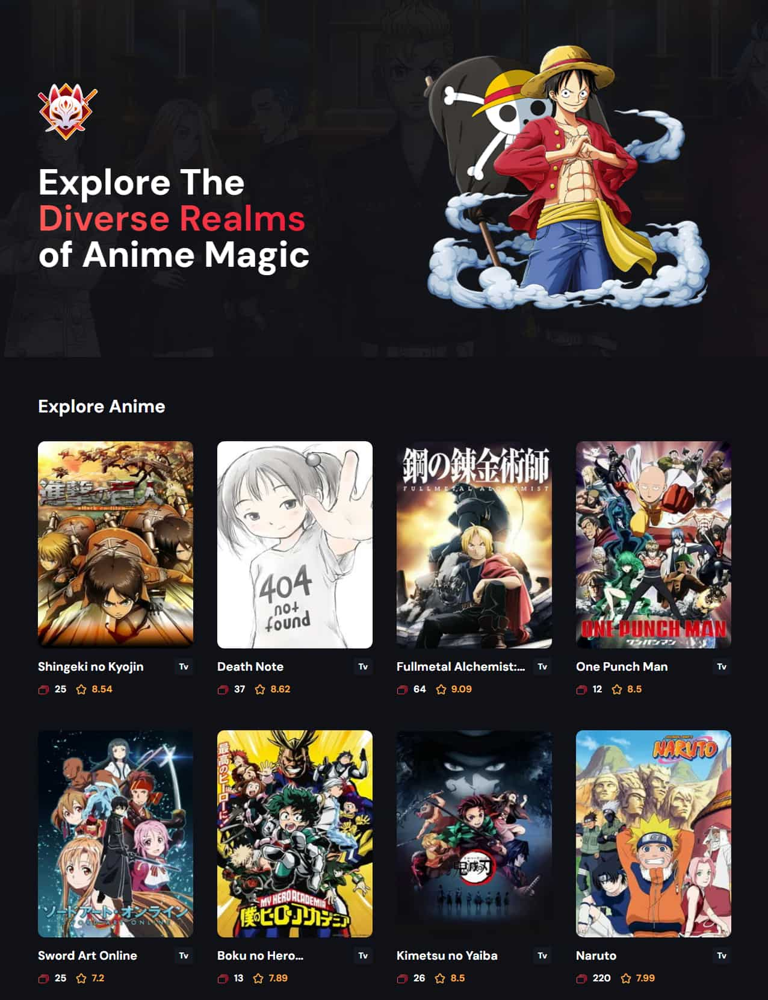

# Build Modern Next 14 Server Side App with Server Actions, Infinite Scroll & Framer Motion Animations


## Introduction
Anime Vault is a server-side application build using Server Actions, infinite scrolling and Framer Motion animations application with Next 14.

## Implementation
- Server-side application
- Server Actions
- Infinite scrolling
- Framer Motion animations

 Learn from:
  ⭐ JSM Masterclass Experience - https://jsmastery.pro/masterclass

## Installation

Follow these steps to install and run the project:

1. **Clone the repository**

   Open your terminal and run the following command to clone the repository:

   ```bash
   git clone https://github.com/julien-muke/anime_vault.git
   ```

2. **Navigate to the project directory**

   ```bash
   cd anime_vault
   ```

3. **Install Node.js**

   The project requires Node.js to run. If you don't have it installed, you can download it from [here](https://nodejs.org/en/download/).

4. **Install the required packages**

   The project requires several packages to be installed. Run the following command to install them:

   ```bash
   npm i
   ```

    ```bash
   npm install react-intersection-observer
   ```

     ```bash
   npm install framer-motion
   ```

5. **Start the server**

   Run the following command to start the server:

   ```bash
   npm run start
   ```


